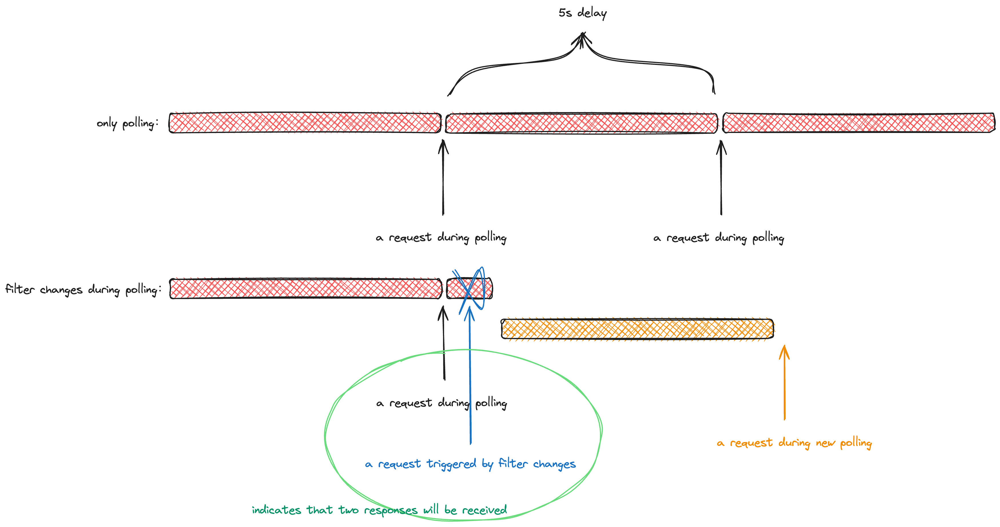

# net-rotation
每次请求函数都会轮训调用，如果调用参数改变重新调用请求函数则每次都会取参数改变之后的最新的请求

# build
通过`pnpm run build`进行打包

# usegae
1. `cjs`
  通过`const Rotation = require('net-rotation')`引入
2. `esm`
  通过`import Rotation from 'net-rotation'`引入
3. `script`
  通过`const Rotation = window.netRotation`引入
4. `Rotation`使用
  ```js
  // 定义rotation对象
  const rotation = new Rotation()
  rotation.poll(
    (params) => {
      // 网络请求
      return axios(params)
    },
    // 处理网络请求的返回值，axios的响应拦截依然有效
    (res) => {
      console.log(res);
    },
    params
  )

  // 需要改变axios的请求内容params，则需要重新调用rotation.poll

  rotation.poll(
    (newParams) => {
      // 网络请求
      return axios(newParams)
    },
    // 处理网络请求的返回值，axios的响应拦截依然有效
    (res) => {
      console.log(res);
    },
    newParams
  )
  ```

# introduce
在这个项目中为了保证数据的实时性，前端需要使用轮训的方式请求后端获取实时数据，但用户的一些选项改变也要发起请求，此时就会存在数据波动的问题\
两种解决方案:\
1. 选择器状态对比
在每次请求前存储当前选择器的状态（这里称为`copyOfStatus`），在每次请求的返回值到来的时候，将`copyOfStatus`与选择器当前的状态进行对比（这里称为`currentStatus`），如果两者深度对比相同，则说明这个返回值是最新的一次请求的返回值，选择采用；如果不相同，则丢弃请求结果
2. 请求队列
将一段时间内的请求存储到一个队列中，在这段时间被消耗完毕之后，将队列中最新的请求发送出去，保证每次发送的都是最新的请求，我们称这个请求在队列中等待的时间叫做缓冲时间\
决策:\
如果使用`方案2`请求队列，那么要对队列的缓冲时间进行一个估算，如果估算时间不准或者网络出现延迟就会再次出现看板数据的抖动，影响数据的准确性以及观察效果，同时考虑到业务需求方是`BY`秒级别的实时性以及浏览器`setTimeout`不准确的特性，从而搁置第二种方案\
相比于第二种方案，第一种方案的实时性是最好的，数据准确性也是最好的，但是存在请求结果丢弃的问题还有对选择器的状态深对比的问题\
优化:\
对于请求丢弃的问题，可以在因为选择器改变而发起请求的时候，停止现在存在的轮训定时器，然后开启一个新的轮训定时器，这样就能保证在用户进行选择器改变的时候，最多只有一个请求被丢弃\

对于选择器内容深度比较耗时的问题，进一步的优化，使用时间戳，而不是使用选择器状态比较。因为从业务上讲，用户需要的是看到最新一次的请求的结果，所以这里使用时间戳可以解决这个问题。方案是使用一个“全局”时间锚点，记录最近一次发起请求的时间，在每一次请求发送前再记录下这个请求发送的时间，当这个请求返回的时候，再次校验这个请求发送的时间是否大于最近一次发起请求的时间，如果是就说明这个请求是最新的请求。这里充分利用了闭包以及浏览器的js引擎是单线程处理js代码的前提\
